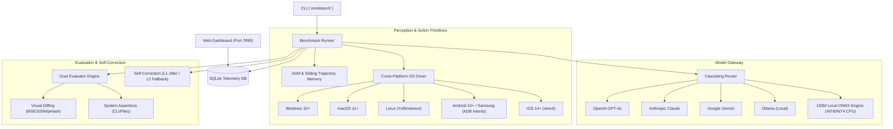

# OmniBench 1.0 — Universal Computer Use Model & Benchmark Framework

<div align="center">

[](https://www.python.org/)
[](https://opensource.org/licenses/MIT)
[](https://onnxruntime.ai/)
[](https://huggingface.co/spaces)
[](#cross-platform-automation-drivers)

**OmniBench 1.0** is an open-source, universal computer use model framework and benchmark suite. It seamlessly integrates cross-platform automation drivers, a local CPU-optimized 100M parameter vision-language model engine (<1.1 GiB RAM usage), a multi-provider gateway router, and dual evaluation engines.

</div>

---

## ✨ Key Features

- **🚀 Hybrid Local 100M ONNX Model Engine**: Runs lightweight vision-language model inference on host CPU using ONNX Runtime (INT8/INT4 dynamic quantization) with memory consumption under **1.1 GiB RAM** (ideal for low-spec Intel Celeron / mobile environments).
- **🌐 Universal Model Gateway**: Priority-ordered cascading router supporting **OpenAI (GPT-4o)**, **Anthropic (Claude 3.5)**, **Google Gemini**, **Ollama**, **Local ONNX**, and **Mock** adapters.
- **🖥️ 5-OS Automation Drivers**: Full action primitive coverage (`click`, `double_click`, `right_click`, `drag`, `type`, `key_combination`, `scroll`, `wait`, `call_contact`, `launch_app`) across:
  - 🪟 **Windows 10+** (Win32 API)
  - 🍏 **macOS 11+** (Quartz / CoreGraphics)
  - 🐧 **Linux 2020+** (Xvfb / xdotool)
  - 🤖 **Android 10+** (ADB & Intents, Samsung Galaxy support)
  - 📱 **iOS 14+** (simctl / XCUITest daemon)
- **👁️ Visual Grounding & Set-of-Marks (SoM)**: Automated UI element bounding box annotation, screenshot scaling/tiling, and sliding trajectory memory buffer.
- **🎯 Dual Evaluator Engine**: Combines visual state diffing (MSE, SSIM, pHash distance) with system state assertions (`file_exists`, `file_contains`, `cmd_output`, `env_var`).
- **📊 SQLite Telemetry & Dark Web Dashboard**: Rich terminal CLI (`omnibench`) and real-time Dark Glassmorphism web SPA served on port `7890`.

---

## 🏛️ System Architecture



---

## 🛠️ Quickstart & Installation

```bash
# Clone repository
git clone https://github.com/your-username/omnibench.git
cd omnibench

# Install package in editable mode with development dependencies
pip install -e ".[dev]"
```

---

## ⚡ Command Line Interface (`omnibench`)

```bash
# View configuration
omnibench config

# View supported benchmark domains and task counts
omnibench dataset

# Run benchmark evaluation episode
omnibench run --domain omnibench_native --model mock --limit 3

# View benchmark run leaderboard
omnibench monitor

# Query SQLite telemetry database
omnibench db --sql "SELECT run_id, domain, model_name, score_avg FROM runs"

# Launch dark web dashboard UI
omnibench dashboard --port 7890
```

---

## 📱 Mobile Phone Deployment Example (Samsung Galaxy)

OmniBench includes native intent primitives for Android calling & messaging:

```python
from omnibench.drivers.android import AndroidDriver

# Connect to Samsung Galaxy phone via ADB (or auto mock fallback)
driver = AndroidDriver(mock=True)
driver.connect()

# Launch Samsung Dialer & Call Contact
driver.launch_app("com.samsung.android.dialer")
driver.call_contact("Vanya Chaudhary")
```

Run the Android deployment runner script:
```bash
python scripts/deploy_android.py --contact "Vanya Chaudhary"
```

---

## 🤗 Hugging Face Deployment

Build a self-contained Hugging Face Space Gradio demo:

```bash
# Build local ./hf_space/ bundle
python scripts/deploy_hf.py

# Push to Hugging Face Hub (Space + Multi-Format Model Hub)
python scripts/deploy_hf.py --repo-id <your-username>/omnibench-demo --model-repo-id <your-username>/omnibench-1.0-100m --token <your_hf_token>
```

---

## 🧪 Benchmark Domains Supported

| Domain | Platform | Description |
| :--- | :--- | :--- |
| **OSWorld** | Desktop (Linux/Win/Mac) | Desktop OS task navigation & multi-app workflows |
| **WebArena** | Web Browser | E-commerce, CMS, and web application interactions |
| **AndroidWorld** | Android Mobile | Mobile app navigation, settings, calling, and messaging |
| **Mind2Web** | Web Browser | Web search, form filling, and data extraction |
| **GAIA** | General AI | Multi-step reasoning with tool & system execution |
| **OmniBench Native** | Universal | Native benchmark suite testing all 7 core pillars |

---

## 🤝 Contributing

Contributions are welcome! Please feel free to submit a Pull Request.

---

## 📜 License

This project is licensed under the **MIT License** — see the [LICENSE](LICENSE) file for details.
